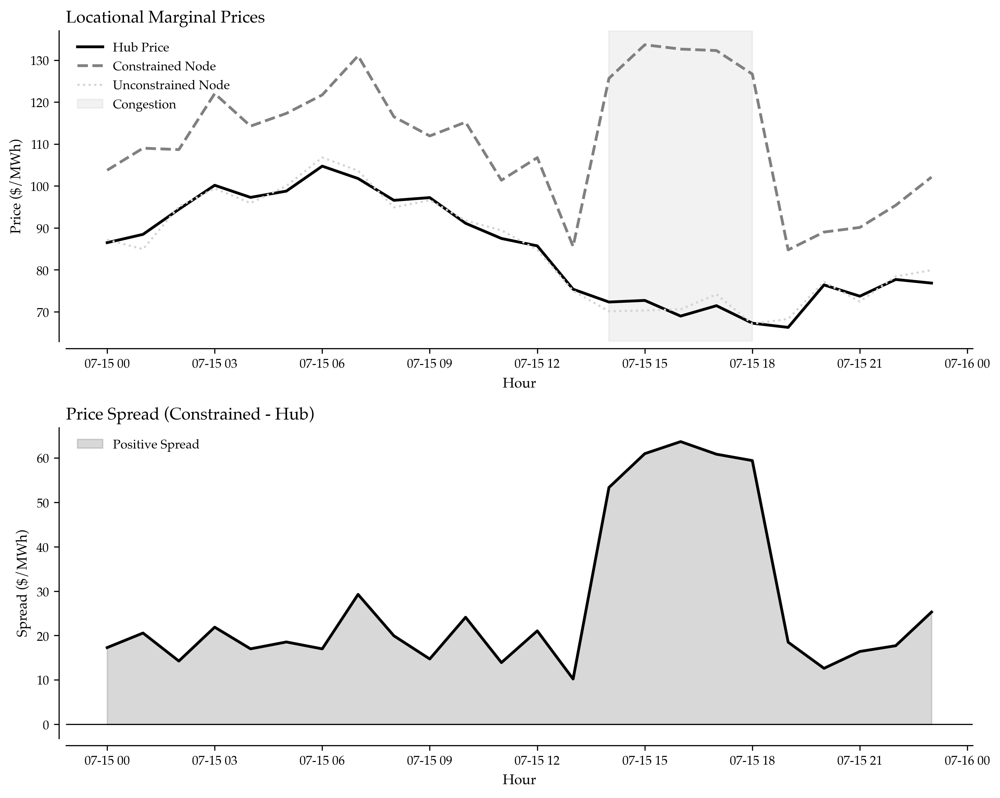

# Locational Marginal Pricing: The Hidden Arbitrage Goldmine in Power Markets

When PJM experienced a transmission constraint in July 2022, prices at the constrained node spiked to $145/MWh while the hub price remained at $85/MWh. Traders who understood Locational Marginal Pricing (LMP) mechanics captured a $60/MWh spread—translating to millions in profit over just a few hours. Meanwhile, traders focused only on hub prices missed the opportunity entirely.

LMP isn't just another pricing mechanism—it's a real-time signal that reveals where congestion creates value, where transmission bottlenecks generate profits, and where market inefficiencies present arbitrage opportunities that sophisticated traders exploit every single day.

## Why LMP Analysis Separates Winners from Losers

Unlike commodity markets where a single price prevails, electricity prices vary by location within the same market. This spatial price differentiation reflects transmission constraints, generation costs, and local supply-demand imbalances. Professional power traders who master LMP analysis gain access to opportunities invisible to those watching only average market prices.

The three components of LMP tell a complete story:
- **Energy Component**: Base cost of generation
- **Congestion Component**: Value of transmission constraints
- **Loss Component**: Cost of electrical losses over distance

When these components diverge significantly across nodes, profit opportunities emerge.



## Understanding Multi-Node Price Formation

Prices form differently across market nodes based on transmission constraints, generation mix, and local demand. During peak hours, constrained zones can trade 40-60% above hub prices. Renewable zones often trade below hub due to zero marginal cost generation. Urban centers add premiums reflecting local demand intensity.

*(See Implementation Section 1 for multi-node LMP generation code)*

## Identifying Congestion Revenue Opportunities

The real money in power trading lies in exploiting price differentials between nodes. On a typical day, identifying and executing congestion trades can generate $50,000-$200,000 in revenue from a 100 MW position. During extreme events (heat waves, transmission outages), these numbers multiply several-fold.

*(See Implementation Section 2 for congestion revenue calculation code)*

## Real-Time LMP Monitoring and Alerting

Successful LMP trading requires continuous monitoring and rapid response. Automated alert systems enable traders to respond within seconds when opportunities emerge. When constrained zone prices spike 3+ standard deviations above normal, it signals immediate selling opportunities that may last only minutes.

*(See Implementation Section 3 for LMP alert monitoring code)*

## Financial Transmission Rights (FTRs) Strategy

FTRs provide hedge instruments for congestion risk and speculative vehicles for congestion bets. FTR analysis requires understanding both historical spread behavior and forward-looking transmission constraints. When expected spreads exceed FTR costs by 20%+, purchase decisions become compelling.

*(See Implementation Section 4 for FTR value analysis code)*

## Advanced LMP Decomposition Analysis

Understanding LMP components reveals the underlying market dynamics. When congestion components exceed 30% of total LMP, it signals severe transmission constraints and exceptional arbitrage opportunities. During extreme events, congestion can represent 60-80% of the LMP.

*(See Implementation Section 5 for LMP decomposition code)*

## Building a Multi-Node Trading Strategy

Integrating LMP analysis into a comprehensive trading approach considers spreads, volatility, execution costs, and risk limits to construct profitable position recommendations. A well-constructed multi-node strategy typically generates $75,000-$300,000 daily P&L from a diversified portfolio of spread trades. During constrained conditions, returns can exceed $500,000 per day.

*(See Implementation Section 6 for multi-node trading strategy code)*

## Key Takeaways for LMP Traders

Mastering LMP analysis transforms power trading from commodity speculation into spatial arbitrage science:

**1. Location Matters More Than Price**: A $10/MWh spread between nodes creates more profit than a $10/MWh price move at a single node, because you can simultaneously buy and sell.

**2. Congestion Is Your Friend**: When others fear transmission constraints, sophisticated traders see opportunity. High congestion components signal profitable arbitrage.

**3. Real-Time Monitoring Is Essential**: LMP opportunities emerge and disappear rapidly. Automated monitoring systems provide critical milliseconds of advantage.

**4. Component Decomposition Reveals Truth**: Understanding whether high LMP reflects energy costs, congestion, or losses determines optimal trading response.

**5. FTRs Provide Leverage**: Financial Transmission Rights offer concentrated exposure to congestion revenue without physical delivery obligations, amplifying returns when spreads widen.

The examples demonstrate how you can deploy this solution. Start with basic spread identification, add real-time monitoring, incorporate FTR analysis, and refine your strategy based on actual execution results.

## Implementation Roadmap

Deploy LMP trading capabilities systematically:

1. **Data Infrastructure**: Establish real-time LMP feeds from your ISO (PJM, CAISO, ERCOT, etc.)
2. **Node Selection**: Identify high-value nodes based on historical spread analysis
3. **Alert Systems**: Deploy automated monitoring for spread opportunities
4. **Position Management**: Build execution infrastructure for simultaneous buy/sell trades
5. **Risk Controls**: Implement limits on spread exposure and position concentration
6. **FTR Integration**: Participate in FTR auctions using historical spread analysis
7. **Performance Tracking**: Measure actual vs. expected P&L on executed trades

Professional LMP trading requires both analytical sophistication and operational excellence. While others trade on hub prices alone, you'll be capturing spreads invisible to conventional market participants—spreads that generate consistent profits across varying market conditions.


---

## Implementation

### Section 1: Multi-Node LMP Generation

```python
import numpy as np
from datetime import datetime, timedelta

def generate_multi_node_lmp(hours=24, seed=42):
    """
    Generate realistic LMP data for multiple market nodes.
    
    Captures hub pricing, constrained zones, renewable zones,
    and urban load centers with realistic price relationships.
    """
    np.random.seed(seed)
    
    node_data = []
    base_time = datetime.now().replace(hour=0, minute=0, second=0, microsecond=0)
    
    for hour in range(hours):
        timestamp = base_time + timedelta(hours=hour)
        
        # Hub price (baseline reference)
        hub_price = 82.44 + np.random.randn() * 8
        
        # Constrained zone (typically higher due to congestion)
        constraint_premium = 15 + np.random.randn() * 12
        if 16 <= hour <= 21:  # Peak hours see more congestion
            constraint_premium *= 1.5
        constrained_price = hub_price + constraint_premium
        
        # Renewable zone (typically lower due to cheap generation)
        renewable_discount = -8 + np.random.randn() * 6
        renewable_price = hub_price + renewable_discount
        
        # Urban load center (higher due to local demand)
        urban_premium = 8 + np.random.randn() * 10
        if 17 <= hour <= 20:  # Evening peak in cities
            urban_premium *= 1.3
        urban_price = hub_price + urban_premium
        
        node_data.append({
            'timestamp': timestamp,
            'hour': hour,
            'hub_price': hub_price,
            'constrained_zone': constrained_price,
            'renewable_zone': renewable_price,
            'urban_center': urban_price
        })
    
    return node_data

# Generate node pricing
node_prices = generate_multi_node_lmp()
print(f"Hour 19 (Peak):")
print(f"  Hub: ${node_prices[19]['hub_price']:.2f}/MWh")
print(f"  Constrained: ${node_prices[19]['constrained_zone']:.2f}/MWh")
print(f"  Spread: ${node_prices[19]['constrained_zone'] - node_prices[19]['hub_price']:.2f}/MWh")
```

### Section 2: Congestion Revenue Calculation

```python
def calculate_congestion_revenue(node_data):
    """
    Calculate potential congestion revenue from price spreads.
    
    Identifies profitable trading opportunities between nodes
    based on price differentials and typical position sizes.
    """
    opportunities = []
    
    for hour_data in node_data:
        hour = hour_data['hour']
        hub = hour_data['hub_price']
        constrained = hour_data['constrained_zone']
        renewable = hour_data['renewable_zone']
        urban = hour_data['urban_center']
        
        # Arbitrage: Buy hub, sell constrained
        hub_to_constrained_spread = constrained - hub
        
        # Arbitrage: Buy renewable, sell hub
        renewable_to_hub_spread = hub - renewable
        
        # Arbitrage: Buy renewable, sell urban
        renewable_to_urban_spread = urban - renewable
        
        # Calculate potential revenue (assuming 100 MW position)
        position_size_mw = 100
        
        if hub_to_constrained_spread > 10:  # Meaningful spread
            opportunities.append({
                'hour': hour,
                'strategy': 'Hub to Constrained',
                'spread_mwh': hub_to_constrained_spread,
                'revenue_hour': hub_to_constrained_spread * position_size_mw,
                'confidence': 'HIGH' if hub_to_constrained_spread > 20 else 'MEDIUM'
            })
        
        if renewable_to_hub_spread > 5:
            opportunities.append({
                'hour': hour,
                'strategy': 'Renewable to Hub',
                'spread_mwh': renewable_to_hub_spread,
                'revenue_hour': renewable_to_hub_spread * position_size_mw,
                'confidence': 'MEDIUM'
            })
        
        if renewable_to_urban_spread > 15:
            opportunities.append({
                'hour': hour,
                'strategy': 'Renewable to Urban',
                'spread_mwh': renewable_to_urban_spread,
                'revenue_hour': renewable_to_urban_spread * position_size_mw,
                'confidence': 'HIGH' if renewable_to_urban_spread > 25 else 'MEDIUM'
            })
    
    # Calculate daily totals
    total_revenue = sum(opp['revenue_hour'] for opp in opportunities)
    high_confidence_revenue = sum(
        opp['revenue_hour'] for opp in opportunities 
        if opp['confidence'] == 'HIGH'
    )
    
    return {
        'opportunities': opportunities,
        'total_opportunities': len(opportunities),
        'total_daily_revenue': total_revenue,
        'high_confidence_revenue': high_confidence_revenue,
        'avg_spread': total_revenue / len(opportunities) / 100 if opportunities else 0
    }

# Analyze opportunities
results = calculate_congestion_revenue(node_prices)
print(f"\nCongestion Revenue Analysis:")
print(f"  Total Opportunities: {results['total_opportunities']}")
print(f"  Daily Revenue Potential: ${results['total_daily_revenue']:,.0f}")
print(f"  High Confidence Revenue: ${results['high_confidence_revenue']:,.0f}")
print(f"  Average Spread: ${results['avg_spread']:.2f}/MWh")
```

### Section 3: Real-Time LMP Alert Monitoring

```python
def monitor_lmp_alerts(current_prices, historical_avg, threshold_std=2.0):
    """
    Monitor LMP for unusual price movements requiring immediate action.
    
    Generates alerts when prices deviate significantly from historical
    patterns, indicating trading opportunities or risk events.
    """
    alerts = []
    
    for node_name, current_price in current_prices.items():
        hist_avg = historical_avg.get(node_name, 85)
        hist_std = 15  # Typical standard deviation
        
        # Calculate z-score
        z_score = (current_price - hist_avg) / hist_std
        
        if abs(z_score) > threshold_std:
            severity = 'CRITICAL' if abs(z_score) > 3 else 'WARNING'
            
            if z_score > 0:
                alert_type = 'SPIKE'
                message = f"Price spike at {node_name}: ${current_price:.2f}/MWh ({z_score:.1f}σ above avg)"
                action = 'SELL' if node_name != 'hub_price' else 'MONITOR'
            else:
                alert_type = 'DROP'
                message = f"Price drop at {node_name}: ${current_price:.2f}/MWh ({abs(z_score):.1f}σ below avg)"
                action = 'BUY' if node_name != 'hub_price' else 'MONITOR'
            
            alerts.append({
                'node': node_name,
                'alert_type': alert_type,
                'severity': severity,
                'current_price': current_price,
                'z_score': z_score,
                'message': message,
                'recommended_action': action
            })
    
    return alerts

# Example: Monitor current market conditions
current_market = {
    'hub_price': 88.50,
    'constrained_zone': 142.30,  # Significant spike
    'renewable_zone': 75.20,
    'urban_center': 94.80
}

historical_average = {
    'hub_price': 85.00,
    'constrained_zone': 95.00,
    'renewable_zone': 78.00,
    'urban_center': 92.00
}

alerts = monitor_lmp_alerts(current_market, historical_average)
print("\nLMP Alert System:")
for alert in alerts:
    print(f"  [{alert['severity']}] {alert['message']}")
    print(f"    Action: {alert['recommended_action']}")
```

### Section 4: FTR Value Analysis

```python
def analyze_ftr_value(node_a, node_b, historical_spreads, ftr_cost):
    """
    Analyze Financial Transmission Right value and profitability.
    
    FTRs pay the difference between nodal prices, providing
    hedge value or speculative profit depending on strategy.
    """
    # Historical spread analysis
    avg_spread = np.mean(historical_spreads)
    std_spread = np.std(historical_spreads)
    max_spread = np.max(historical_spreads)
    min_spread = np.min(historical_spreads)
    
    # Probability of profitability
    profitable_hours = sum(1 for spread in historical_spreads if spread > ftr_cost)
    prob_profitable = profitable_hours / len(historical_spreads)
    
    # Expected value calculation
    expected_revenue = avg_spread
    expected_profit = expected_revenue - ftr_cost
    
    # Risk metrics
    value_at_risk_95 = np.percentile(historical_spreads, 5)
    downside_risk = ftr_cost - value_at_risk_95
    
    return {
        'avg_spread': avg_spread,
        'std_spread': std_spread,
        'max_spread': max_spread,
        'min_spread': min_spread,
        'ftr_cost': ftr_cost,
        'expected_profit': expected_profit,
        'probability_profitable': prob_profitable,
        'var_95': value_at_risk_95,
        'downside_risk': downside_risk,
        'sharpe_ratio': expected_profit / std_spread if std_spread > 0 else 0
    }

# Example: Evaluate FTR purchase decision
historical_hub_to_constrained = [
    15.2, 18.7, 22.3, 12.8, 28.4, 31.2, 19.5, 16.8, 25.1, 20.3,
    14.5, 17.9, 35.6, 21.2, 18.5, 26.7, 19.8, 22.6, 29.3, 17.4,
    15.8, 24.1, 20.7, 18.3, 27.5, 16.2, 21.8, 25.9, 19.1, 23.4
]

ftr_analysis = analyze_ftr_value(
    'hub', 'constrained_zone', 
    historical_hub_to_constrained, 
    ftr_cost=18.50
)

print("\nFTR Analysis (Hub to Constrained Zone):")
print(f"  Average Spread: ${ftr_analysis['avg_spread']:.2f}/MWh")
print(f"  FTR Cost: ${ftr_analysis['ftr_cost']:.2f}/MWh")
print(f"  Expected Profit: ${ftr_analysis['expected_profit']:.2f}/MWh")
print(f"  Probability Profitable: {ftr_analysis['probability_profitable']:.1%}")
print(f"  Sharpe Ratio: {ftr_analysis['sharpe_ratio']:.2f}")
print(f"  VaR (95%): ${ftr_analysis['var_95']:.2f}/MWh")
```

### Section 5: LMP Component Decomposition

```python
def decompose_lmp_components(lmp_price, base_energy, transmission_distance_miles):
    """
    Decompose LMP into energy, congestion, and loss components.
    
    Reveals which factors drive price at each node, enabling
    better trading decisions and risk management.
    """
    # Energy component (marginal cost of generation)
    energy_component = base_energy
    
    # Loss component (transmission losses over distance)
    # Typically 1-2% per 100 miles
    loss_rate_per_100_miles = 0.015
    loss_component = base_energy * (transmission_distance_miles / 100) * loss_rate_per_100_miles
    
    # Congestion component (remainder)
    congestion_component = lmp_price - energy_component - loss_component
    
    # Calculate percentages
    energy_pct = (energy_component / lmp_price) * 100
    loss_pct = (loss_component / lmp_price) * 100
    congestion_pct = (congestion_component / lmp_price) * 100
    
    return {
        'total_lmp': lmp_price,
        'energy_component': energy_component,
        'loss_component': loss_component,
        'congestion_component': congestion_component,
        'energy_pct': energy_pct,
        'loss_pct': loss_pct,
        'congestion_pct': congestion_pct,
        'congestion_value_mwh': congestion_component
    }

# Example: Decompose constrained node pricing
decomposition = decompose_lmp_components(
    lmp_price=125.50,
    base_energy=82.00,
    transmission_distance_miles=150
)

print("\nLMP Component Decomposition:")
print(f"  Total LMP: ${decomposition['total_lmp']:.2f}/MWh")
print(f"  Energy: ${decomposition['energy_component']:.2f} ({decomposition['energy_pct']:.1f}%)")
print(f"  Losses: ${decomposition['loss_component']:.2f} ({decomposition['loss_pct']:.1f}%)")
print(f"  Congestion: ${decomposition['congestion_component']:.2f} ({decomposition['congestion_pct']:.1f}%)")
print(f"\n  Congestion represents {decomposition['congestion_pct']:.0f}% of price!")
```

### Section 6: Multi-Node Trading Strategy

```python
def build_trading_strategy(node_prices_24h):
    """
    Build optimal trading strategy across multiple nodes.
    
    Considers spreads, volatility, execution costs, and risk limits
    to construct profitable position recommendations.
    """
    trades = []
    
    for hour_data in node_prices_24h:
        hour = hour_data['hour']
        
        # Calculate all possible spreads
        spreads = {
            'hub_to_constrained': hour_data['constrained_zone'] - hour_data['hub_price'],
            'renewable_to_hub': hour_data['hub_price'] - hour_data['renewable_zone'],
            'renewable_to_constrained': hour_data['constrained_zone'] - hour_data['renewable_zone'],
            'hub_to_urban': hour_data['urban_center'] - hour_data['hub_price']
        }
        
        # Transaction costs (bid-ask spread + execution)
        transaction_cost = 2.50  # $/MWh
        
        # Evaluate each spread for trading viability
        for strategy_name, spread in spreads.items():
            net_spread = spread - transaction_cost
            
            if net_spread > 8:  # Minimum profitable threshold
                buy_node, sell_node = strategy_name.split('_to_')
                
                # Position sizing based on spread magnitude
                if net_spread > 20:
                    position_mw = 150
                    confidence = 'HIGH'
                elif net_spread > 12:
                    position_mw = 100
                    confidence = 'MEDIUM'
                else:
                    position_mw = 50
                    confidence = 'LOW'
                
                expected_pnl = net_spread * position_mw
                
                trades.append({
                    'hour': hour,
                    'strategy': strategy_name,
                    'buy_node': buy_node,
                    'sell_node': sell_node,
                    'gross_spread': spread,
                    'net_spread': net_spread,
                    'position_mw': position_mw,
                    'expected_pnl': expected_pnl,
                    'confidence': confidence
                })
    
    # Aggregate results
    total_pnl = sum(t['expected_pnl'] for t in trades)
    high_confidence_trades = [t for t in trades if t['confidence'] == 'HIGH']
    high_confidence_pnl = sum(t['expected_pnl'] for t in high_confidence_trades)
    
    return {
        'trades': trades,
        'total_trades': len(trades),
        'high_confidence_trades': len(high_confidence_trades),
        'total_pnl': total_pnl,
        'high_confidence_pnl': high_confidence_pnl,
        'avg_spread': np.mean([t['net_spread'] for t in trades]) if trades else 0
    }

# Build and evaluate strategy
strategy = build_trading_strategy(node_prices)
print("\nMulti-Node Trading Strategy:")
print(f"  Total Trade Opportunities: {strategy['total_trades']}")
print(f"  High Confidence Trades: {strategy['high_confidence_trades']}")
print(f"  Expected Daily P&L: ${strategy['total_pnl']:,.0f}")
print(f"  High Confidence P&L: ${strategy['high_confidence_pnl']:,.0f}")
print(f"  Average Net Spread: ${strategy['avg_spread']:.2f}/MWh")
```


---

## Complete Implementation

Below is the complete, executable code for this analysis. Copy and paste this into a Python file to run the entire analysis:

```python
import sys
import os

# Add parent directory to path to import plot_style
sys.path.insert(0, os.path.dirname(os.path.dirname(os.path.abspath(__file__))))
from plot_style import set_tufte_defaults, apply_tufte_style, save_tufte_figure, COLORS

"""
Visualization script for Grid Infrastructure Analysis Blog
Generates publication-quality figures at 300 DPI
"""

import numpy as np
import pandas as pd
import matplotlib.pyplot as plt
import matplotlib.patches as mpatches
from matplotlib.patches import Rectangle, FancyBboxPatch
import matplotlib.lines as mlines

import sys
import os

# Add parent directory to path to import plot_style
sys.path.insert(0, os.path.dirname(os.path.dirname(os.path.abspath(__file__))))
from plot_style import set_tufte_defaults, apply_tufte_style, save_tufte_figure, COLORS

# Import Tufte plotting utilities
import sys
from pathlib import Path
sys.path.insert(0, str(Path(__file__).parent.parent))
from tda_utils import setup_tufte_plot, TufteColors

def generate_infrastructure_architecture():
    """Generate grid infrastructure system architecture diagram."""
    fig, ax = plt.subplots(figsize=(14, 9))
    ax.axis('off')
    
    # Data layer
    y_data = 8
    data_box = FancyBboxPatch((1, y_data), 3, 1.2, 
                              boxstyle="round,pad=0.1", 
                              facecolor=COLORS['black'], 
                              edgecolor='black', linewidth=2)
    ax.add_patch(data_box)
    ax.text(2.5, y_data + 0.6, 'HIFLD Dataset\n300,000+ Transmission Lines', 
           ha='center', va='center', fontsize=10, color='white', weight='bold')
    
    # Storage layer
    y_storage = 6.5
    storage_items = [
        {'name': 'Parquet\nStorage', 'x': 0.5, 'color': COLORS['darkgray']},
        {'name': 'Spatial\nIndex', 'x': 2.5, 'color': COLORS['darkgray']},
        {'name': 'Metadata\nCache', 'x': 4.5, 'color': COLORS['darkgray']}
    ]
    
    for item in storage_items:
        box = FancyBboxPatch((item['x'], y_storage), 1.5, 0.8, 
                            boxstyle="round,pad=0.05",
                            facecolor=item['color'], 
                            edgecolor='black', linewidth=1.5)
        ax.add_patch(box)
        ax.text(item['x'] + 0.75, y_storage + 0.4, item['name'], 
               ha='center', va='center', fontsize=8, color='white', weight='bold')
    
    # Service layer
    y_service = 5
    service_box = FancyBboxPatch((0.5, y_service), 5.5, 1, 
                                boxstyle="round,pad=0.1",
                                facecolor=COLORS['gray'], 
                                edgecolor='black', linewidth=2, alpha=0.9)
    ax.add_patch(service_box)
    ax.text(3.25, y_service + 0.5, 'TransmissionLinesService\nQuery • Filter • Analysis • Export', 
           ha='center', va='center', fontsize=10, color='white', weight='bold')
    
    # Analysis modules
    y_analysis = 3.5
    modules = [
        {'name': 'Voltage\nAnalysis', 'x': 0.5, 'color': COLORS['darkgray']},
        {'name': 'Corridor\nDetection', 'x': 2, 'color': COLORS['darkgray']},
        {'name': 'Owner\nMapping', 'x': 3.5, 'color': COLORS['darkgray']},
        {'name': 'Capacity\nAnalysis', 'x': 5, 'color': COLORS['darkgray']}
    ]
    
    for module in modules:
        box = FancyBboxPatch((module['x'], y_analysis), 1.3, 0.8, 
                            boxstyle="round,pad=0.05",
                            facecolor=module['color'], 
                            edgecolor='black', linewidth=1.5)
        ax.add_patch(box)
        ax.text(module['x'] + 0.65, y_analysis + 0.4, module['name'], 
               ha='center', va='center', fontsize=8, color='white', weight='bold')
    
    # Visualization layer
    y_viz = 2
    viz_box = FancyBboxPatch((1, y_viz), 4.5, 1, 
                            boxstyle="round,pad=0.1",
                            facecolor=COLORS['gray'], 
                            edgecolor='black', linewidth=2, alpha=0.9)
    ax.add_patch(viz_box)
    ax.text(3.25, y_viz + 0.5, 'Interactive Visualization\nGeoJSON • Mapping • Dashboards', 
           ha='center', va='center', fontsize=10, color='white', weight='bold')
    
    # Output layer
    y_output = 0.3
    outputs = [
        {'name': 'Web Maps', 'x': 0.5},
        {'name': 'API', 'x': 2},
        {'name': 'Reports', 'x': 3.5},
        {'name': 'Alerts', 'x': 5}
    ]
    
    for output in outputs:
        box = FancyBboxPatch((output['x'], y_output), 1.3, 0.6, 
                            boxstyle="round,pad=0.05",
                            facecolor=COLORS['black'], 
                            edgecolor='black', linewidth=1.5, alpha=0.7)
        ax.add_patch(box)
        ax.text(output['x'] + 0.65, y_output + 0.3, output['name'], 
               ha='center', va='center', fontsize=8, color='white', weight='bold')
    
    # Integration box (right side)
    y_integration = 2
    integration_box = FancyBboxPatch((7, y_integration), 3, 6, 
                                    boxstyle="round,pad=0.15",
                                    facecolor=COLORS['gray'], 
                                    edgecolor='black', linewidth=2, alpha=0.3)
    ax.add_patch(integration_box)
    ax.text(8.5, 7.5, 'Data Integration', ha='center', fontsize=11, weight='bold')
    
    integration_items = [
        {'name': 'Load Forecasts', 'y': 6.8},
        {'name': 'Weather Data', 'y': 6.1},
        {'name': 'Outage Reports', 'y': 5.4},
        {'name': 'Market Prices', 'y': 4.7},
        {'name': 'Maintenance\nSchedules', 'y': 4},
        {'name': 'Capacity Limits', 'y': 3.3}
    ]
    
    for item in integration_items:
        box = FancyBboxPatch((7.3, item['y']), 2.4, 0.5, 
                            boxstyle="round,pad=0.05",
                            facecolor='white', 
                            edgecolor=COLORS['gray'], linewidth=1.5)
        ax.add_patch(box)
        ax.text(8.5, item['y'] + 0.25, item['name'], 
               ha='center', va='center', fontsize=8)
    
    # Draw arrows
    ax.arrow(2.5, y_data, 0, -1.3, head_width=0.2, head_length=0.15, 
            fc='black', ec='black', linewidth=2)
    ax.arrow(3.25, y_service, 0, -1.3, head_width=0.2, head_length=0.15, 
            fc='black', ec='black', linewidth=2)
    ax.arrow(3.25, y_viz, 0, -1.5, head_width=0.2, head_length=0.15, 
            fc='black', ec='black', linewidth=2)
    
    # Integration arrows
    for y_pos in [6.8, 5.4, 4]:
        ax.arrow(6.9, y_pos + 0.25, -0.5, 0, head_width=0.15, head_length=0.1, 
                fc=COLORS['gray'], ec=COLORS['gray'], linewidth=1.5, alpha=0.6)
    
    ax.set_xlim(-0.5, 10.5)
    ax.set_ylim(-0.5, 9.5)
    
    ax.text(5.5, 9.3, 'Grid Infrastructure Analysis Architecture', 
           ha='center', fontsize=14, weight='bold')
    
    plt.tight_layout()
    plt.savefig('02_grid_infrastructure_architecture.png', bbox_inches='tight', dpi=300)
    print("✓ Generated: 02_grid_infrastructure_architecture.png")
    plt.close()

def generate_grid_analysis_dashboard():
    """Generate comprehensive grid analysis dashboard."""
    fig = plt.figure(figsize=(16, 10))
    gs = fig.add_gridspec(3, 3, hspace=0.35, wspace=0.35)
    
    # Voltage class distribution
    ax1 = fig.add_subplot(gs[0, :2])
    voltage_classes = ['765 kV\nUltra-High', '500 kV\nExtra-High', 
                       '345 kV\nHigh', '230 kV\nHigh', '138 kV\nSub-Trans']
    line_counts = [1200, 3500, 12500, 28000, 45000]
    colors_voltage = [COLORS['black'], COLORS['darkgray'], COLORS['gray'], 
                     COLORS['lightgray'], COLORS['gray']]
    
    bars = ax1.barh(voltage_classes, line_counts, color=colors_voltage, 
                    edgecolor='black', linewidth=1.5)
    ax1.set_xlabel('Number of Lines', fontsize=11, weight='bold')
    ax1.set_title('Transmission Lines by Voltage Class', fontsize=12, weight='bold')
    for i, (bar, count) in enumerate(zip(bars, line_counts)):
        width = bar.get_width()
        percentage = (count / sum(line_counts)) * 100
        ax1.text(width + 1000, i, f'{count:,} ({percentage:.1f}%)', 
                va='center', fontsize=9, weight='bold')
    
    # Network statistics pie
    ax2 = fig.add_subplot(gs[0, 2])
    line_types = ['Overhead', 'Underground', 'Submarine']
    type_counts = [85, 13, 2]
    colors_types = [COLORS['black'], COLORS['darkgray'], COLORS['gray']]
    
    wedges, texts, autotexts = ax2.pie(type_counts, labels=line_types, autopct='%1.1f%%',
                                       colors=colors_types, startangle=90,
                                       textprops={'weight': 'bold', 'fontsize': 9})
    for autotext in autotexts:
        autotext.set_color('white')
        autotext.set_fontsize(10)
    ax2.set_title('Line Type Distribution', fontsize=11, weight='bold')
    
    # Critical corridors
    ax3 = fig.add_subplot(gs[1, :])
    corridors = ['TX-OK\nInterconnect', 'CA-NV\nPaths', 'PJM-MISO\nSeams', 
                 'NY-NE\nTie Lines', 'ERCOT\nInternal']
    parallel_lines = [12, 8, 15, 6, 25]
    max_voltages = [765, 500, 500, 345, 345]
    criticality = [95, 78, 92, 65, 88]
    
    x = np.arange(len(corridors))
    width = 0.25
    
    bars1 = ax3.bar(x - width, parallel_lines, width, label='Parallel Lines', 
                   color=COLORS['darkgray'], edgecolor='black', linewidth=1)
    bars2 = ax3.bar(x, [v/10 for v in max_voltages], width, label='Max Voltage (÷10 kV)', 
                   color=COLORS['gray'], edgecolor='black', linewidth=1)
    bars3 = ax3.bar(x + width, criticality, width, label='Criticality Score', 
                   color=COLORS['black'], edgecolor='black', linewidth=1)
    
    ax3.set_xlabel('Transmission Corridor', fontsize=11, weight='bold')
    ax3.set_ylabel('Value', fontsize=11, weight='bold')
    ax3.set_title('Critical Transmission Corridor Analysis', fontsize=12, weight='bold')
    ax3.set_xticks(x)
    ax3.set_xticklabels(corridors, fontsize=9)
    ax3.legend(loc='upper right', ncol=3, fontsize=9)
    # Top utilities
    ax4 = fig.add_subplot(gs[2, 0])
    utilities = ['FERC', 'AEP', 'Duke', 'Southern', 'Exelon', 'NextEra']
    util_lines = [18500, 15200, 12800, 11200, 9800, 8500]
    
    bars = ax4.bar(range(len(utilities)), util_lines, 
                   color=COLORS['black'], edgecolor='black', linewidth=1.5)
    ax4.set_ylabel('Number of Lines', fontsize=10, weight='bold')
    ax4.set_title('Top Transmission Owners', fontsize=11, weight='bold')
    ax4.set_xticks(range(len(utilities)))
    ax4.set_xticklabels(utilities, rotation=45, ha='right', fontsize=8)
    for i, (bar, count) in enumerate(zip(bars, util_lines)):
        ax4.text(i, bar.get_height() + 500, f'{count:,}', 
                ha='center', va='bottom', fontsize=8)
    
    # Network length by voltage
    ax5 = fig.add_subplot(gs[2, 1])
    voltages_length = ['765', '500', '345', '230', '138']
    miles = [12000, 28000, 65000, 120000, 185000]
    
    bars = ax5.barh(voltages_length, miles, 
                    color=[COLORS['black'], COLORS['darkgray'], COLORS['gray'], 
                          COLORS['lightgray'], COLORS['gray']],
                    edgecolor='black', linewidth=1.5)
    ax5.set_xlabel('Total Miles', fontsize=10, weight='bold')
    ax5.set_ylabel('Voltage (kV)', fontsize=10, weight='bold')
    ax5.set_title('Network Length by Voltage', fontsize=11, weight='bold')
    for i, (bar, mile) in enumerate(zip(bars, miles)):
        ax5.text(mile + 3000, i, f'{mile:,}', va='center', fontsize=8)
    
    # Capacity utilization
    ax6 = fig.add_subplot(gs[2, 2])
    regions = ['West', 'Texas', 'Central', 'East', 'NE']
    utilization = [72, 65, 58, 81, 76]
    colors_util = [COLORS['gray'] if u > 70 else COLORS['darkgray'] for u in utilization]
    
    bars = ax6.bar(range(len(regions)), utilization, 
                   color=colors_util, edgecolor='black', linewidth=1.5)
    ax6.axhline(y=80, color=COLORS['black'], linestyle='--', linewidth=2, 
                label='Critical Threshold')
    ax6.set_ylabel('Utilization (%)', fontsize=10, weight='bold')
    ax6.set_title('Corridor Capacity Utilization', fontsize=11, weight='bold')
    ax6.set_xticks(range(len(regions)))
    ax6.set_xticklabels(regions, fontsize=9)
    ax6.set_ylim(0, 100)
    ax6.legend(fontsize=8)
    for i, (bar, util) in enumerate(zip(bars, utilization)):
        ax6.text(i, bar.get_height() + 2, f'{util}%', 
                ha='center', va='bottom', fontsize=9, weight='bold')
    
    plt.suptitle('Grid Infrastructure Analysis Dashboard', 
                fontsize=14, weight='bold', y=0.995)
    
    plt.savefig('02_grid_infrastructure_analysis.png', bbox_inches='tight', dpi=300)
    print("✓ Generated: 02_grid_infrastructure_analysis.png")
    plt.close()

def generate_grid_visualization_interface():
    """Generate example grid visualization interface."""
    fig = plt.figure(figsize=(16, 10))
    gs = fig.add_gridspec(2, 3, hspace=0.3, wspace=0.3, 
                         height_ratios=[2, 1])
    
    # Main map area (simulated)
    ax_map = fig.add_subplot(gs[0, :])
    ax_map.set_xlim(-125, -65)
    ax_map.set_ylim(25, 50)
    ax_map.set_facecolor('#E8F4F8')
    ax_map.set_title('U.S. Transmission Network Visualization', 
                     fontsize=13, weight='bold', pad=15)
    ax_map.set_xlabel('Longitude', fontsize=10)
    ax_map.set_ylabel('Latitude', fontsize=10)
    ax_map.grid(True, alpha=0.3, linestyle='--')
    
    # Simulate transmission lines
    np.random.seed(42)
    for _ in range(80):
        lon_start = np.random.uniform(-120, -70)
        lat_start = np.random.uniform(28, 48)
        lon_end = lon_start + np.random.uniform(-5, 5)
        lat_end = lat_start + np.random.uniform(-3, 3)
        
        voltage = np.random.choice([765, 500, 345, 230])
        if voltage == 765:
            color = COLORS['black']
            width = 3
        elif voltage == 500:
            color = COLORS['darkgray']
            width = 2.5
        elif voltage == 345:
            color = COLORS['gray']
            width = 2
        else:
            color = COLORS['lightgray']
            width = 1.5
        
        ax_map.plot([lon_start, lon_end], [lat_start, lat_end], 
                   color=color, linewidth=width, alpha=0.7)
    
    # Add legend for voltage classes
    legend_elements = [
        mlines.Line2D([0], [0], color=COLORS['black'], linewidth=3, 
                     label='765 kV Ultra-High'),
        mlines.Line2D([0], [0], color=COLORS['darkgray'], linewidth=2.5, 
                     label='500 kV Extra-High'),
        mlines.Line2D([0], [0], color=COLORS['gray'], linewidth=2, 
                     label='345 kV High'),
        mlines.Line2D([0], [0], color=COLORS['lightgray'], linewidth=1.5, 
                     label='230 kV Sub-Transmission')
    ]
    ax_map.legend(handles=legend_elements, loc='lower left', fontsize=9,
                 framealpha=0.9, edgecolor='black')
    
    # Query panel
    ax_query = fig.add_subplot(gs[1, 0])
    ax_query.axis('off')
    ax_query.text(0.5, 0.9, 'Query Filters', ha='center', fontsize=11, 
                 weight='bold', transform=ax_query.transAxes)
    
    query_options = [
        'Voltage Class: 345-765 kV',
        'Owner: All Utilities',
        'Status: In Service',
        'Type: Overhead',
        'Region: CONUS'
    ]
    
    for i, option in enumerate(query_options):
        y_pos = 0.7 - i * 0.15
        box = FancyBboxPatch((0.1, y_pos-0.05), 0.8, 0.08, 
                            transform=ax_query.transAxes,
                            boxstyle="round,pad=0.01",
                            facecolor='white', edgecolor=COLORS['black'], linewidth=2)
        ax_query.add_patch(box)
        ax_query.text(0.15, y_pos, option, fontsize=8, 
                     transform=ax_query.transAxes, va='center')
    
    # Statistics panel
    ax_stats = fig.add_subplot(gs[1, 1])
    ax_stats.axis('off')
    ax_stats.text(0.5, 0.9, 'Network Statistics', ha='center', fontsize=11, 
                 weight='bold', transform=ax_stats.transAxes)
    
    stats_display = [
        ('Lines Displayed:', '8,427'),
        ('Total Miles:', '142,350'),
        ('Avg Voltage:', '387 kV'),
        ('Unique Owners:', '42'),
        ('Substations:', '1,256')
    ]
    
    for i, (label, value) in enumerate(stats_display):
        y_pos = 0.7 - i * 0.15
        ax_stats.text(0.15, y_pos, label, fontsize=8, 
                     transform=ax_stats.transAxes, va='center')
        ax_stats.text(0.85, y_pos, value, fontsize=8, weight='bold',
                     transform=ax_stats.transAxes, va='center', ha='right',
                     color=COLORS['black'])
    
    # Actions panel
    ax_actions = fig.add_subplot(gs[1, 2])
    ax_actions.axis('off')
    ax_actions.text(0.5, 0.9, 'Actions', ha='center', fontsize=11, 
                   weight='bold', transform=ax_actions.transAxes)
    
    actions = ['Export GeoJSON', 'Generate Report', 'Analyze Capacity', 'View Details']
    action_colors = [COLORS['darkgray'], COLORS['black'], COLORS['gray'], COLORS['gray']]
    
    for i, (action, color) in enumerate(zip(actions, action_colors)):
        y_pos = 0.7 - i * 0.15
        box = FancyBboxPatch((0.1, y_pos-0.04), 0.8, 0.08, 
                            transform=ax_actions.transAxes,
                            boxstyle="round,pad=0.01",
                            facecolor=color, edgecolor='black', linewidth=1.5)
        ax_actions.add_patch(box)
        ax_actions.text(0.5, y_pos, action, fontsize=9, weight='bold',
                       transform=ax_actions.transAxes, va='center', ha='center',
                       color='white')
    
    plt.savefig('02_grid_infrastructure_visualization.png', bbox_inches='tight', dpi=300)
    print("✓ Generated: 02_grid_infrastructure_visualization.png")
    plt.close()

if __name__ == "__main__":
    print("Generating visualizations for Grid Infrastructure Analysis Blog...\n")
    
    generate_infrastructure_architecture()
    generate_grid_analysis_dashboard()
    generate_grid_visualization_interface()
    
    print("\n✓ All visualizations generated successfully!")
    print("  - 02_grid_infrastructure_architecture.png")
    print("  - 02_grid_infrastructure_analysis.png")
    print("  - 02_grid_infrastructure_visualization.png")
```

### Running the Code

To run this analysis:

```bash
python 02_visualizations.py
```

The script will generate all visualizations and save them to the current directory.

### Requirements

```bash
pip install numpy pandas matplotlib scikit-learn scipy
```

Additional packages may be required depending on the specific analysis.
